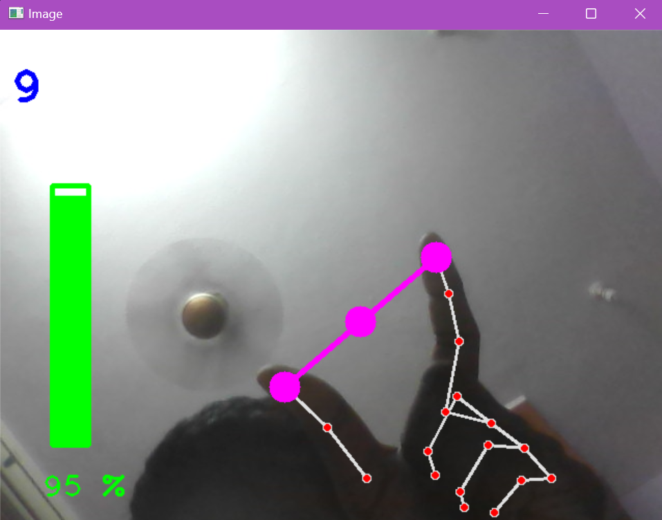

# Hand Gesture Volume Control

This project demonstrates real-time hand gesture-based volume control using a webcam feed. Leveraging the HandTrackingModule, MediaPipe, and OpenCV, the program tracks hand movements and recognizes gestures to adjust system volume. As the user's hand gestures are detected, the distance between the thumb and index finger determines the volume level. Visual feedback is provided through a dynamically adjusting volume bar on the screen. Additionally, the current volume percentage is displayed for user reference.

